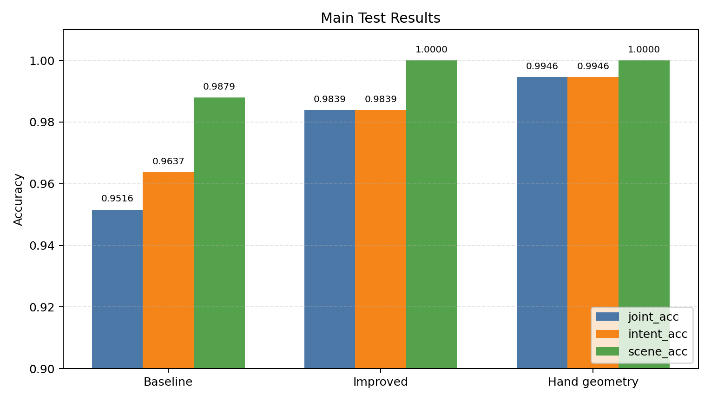
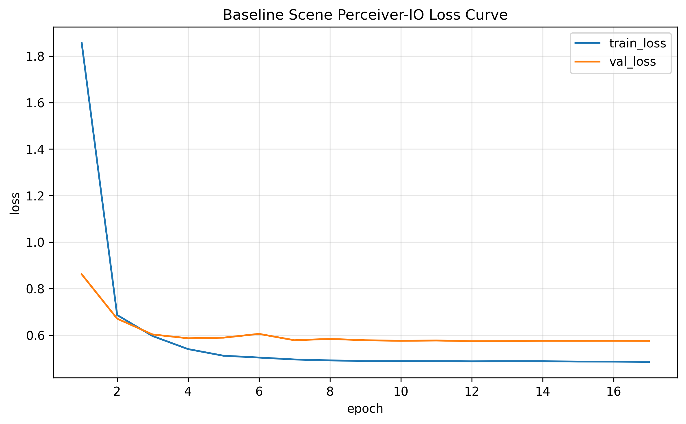
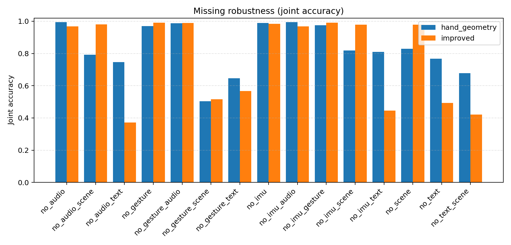
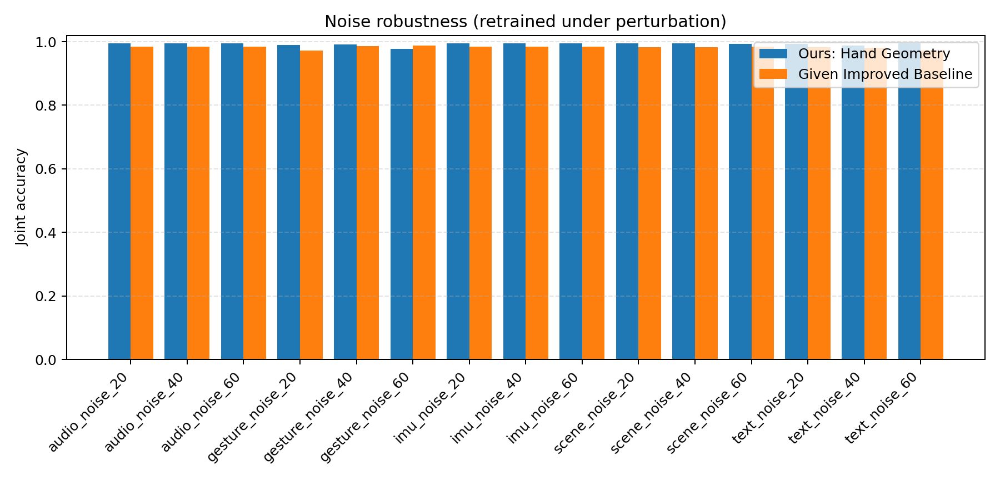

# 多模态 AR 交互意图理解

本项目面向 AR 眼镜交互场景，研究如何利用多源传感器数据识别用户交互意图。任务输入包含 IMU、手势视频、音频、ASR 文本和场景视觉五类模态，输出为 6 类意图与 2 类场景组合而成的 12 类联合标签。

项目在课程给定 baseline / improved baseline 的基础上，完成了全量数据处理、特征提取、训练评估、模态缺失与噪声鲁棒性分析，并进一步引入基于 MediaPipe hand landmarks 的手部几何时序特征。该特征在主测试集和文本缺失条件下均带来了明显提升，是当前最稳定的改进方向。

## 任务定义

意图类别：

```text
menu, select, magnify, narrow, brush, cancel
```

场景类别：

```text
office, museum
```

主任务为 12 类联合分类：

```text
{office, museum} x {menu, select, magnify, narrow, brush, cancel}
```

评价指标：

| 指标 | 含义 |
|---|---|
| `joint_acc` | 场景和意图同时预测正确 |
| `intent_acc` | 只评价 6 类意图预测 |
| `scene_acc` | 只评价 2 类场景预测 |

## 数据与模态

| 模态 | 数据来源 | 特征表示 |
|---|---|---|
| IMU | HoloLens/同步传感器数据 | 10 帧时序 IMU 特征 |
| Gesture | fisheye 视频 | CLIP 手势视觉特征，或 hand landmarks 几何特征 |
| Audio | HoloLens 视频音频 | MFCC |
| Text | ASR 转写文本 | Whisper + SentenceTransformer |
| Scene | fisheye 视频 | ViT 场景视觉特征 |

特征统一对齐到检测出的交互片段，每个片段使用固定长度时序窗口。数据集和模型缓存体积较大，默认不进入 git；仓库主要保留代码、轻量图表和复现实验入口。

## 方法概览

### 给定 baseline

课程给定程序包含基础多模态分类流程：对各模态分别提取特征，按交互片段对齐后送入多模态融合网络，完成 12 类联合分类。

### Improved baseline

给定 improved baseline 在 baseline 上加入了更强的融合结构：

- 以 Gesture / Text / Scene 作为主锚点进行融合。
- 通过 Perceiver-style latent tokens 汇聚多模态信息。
- 使用 IMU / Audio 残差辅助注入。
- 引入 modality gate、intent/scene 辅助头、gesture intent 辅助监督。
- 使用 label smoothing、dropout、weight decay、gradient clipping 等训练稳定策略。

该模型在完整测试集上已经达到较高准确率，但诊断显示它对文本语义依赖较强：当 Text 模态缺失时，性能下降明显。

### 手部几何特征

为降低模型对 ASR 文本的依赖，项目新增了基于 MediaPipe hand landmarks 的手部几何时序特征：

```text
code/feature_extraction/extract_hand_geometry_features.py
```

每个交互片段抽取 `(10, 96)` 维手部几何序列，包含：

- 手部是否存在、中心点、bbox 尺寸。
- 21 个 hand landmarks 的相对坐标。
- 指尖到手腕距离。
- 拇指与其他指尖的 pinch 距离。
- 掌宽、手高等尺度归一化几何量。

与 CLIP 手势特征相比，hand geometry 更关注动作轨迹和手形结构，尤其适合区分 `brush`、`magnify`、`select` 等细粒度交互动作。

## 实验结果

### 主结果



| 模型 / 特征 | joint_acc | intent_acc | scene_acc |
|---|---:|---:|---:|
| Baseline + MediaPipe Tasks | 0.9516 | 0.9637 | 0.9879 |
| Improved baseline | 0.9839 | 0.9839 | 1.0000 |
| Hand geometry | **0.9946** | **0.9946** | **1.0000** |

Hand geometry 在主测试集上只错 4 个样本，12 类联合分类准确率达到 `0.9946`。




### 模态缺失鲁棒性



| 缺失设置 | Improved baseline | Hand geometry | 变化 |
|---|---:|---:|---:|
| no_text | 0.4933 | **0.7675** | +0.2742 |
| no_audio_text | 0.3723 | **0.7473** | +0.3750 |
| no_imu_text | 0.4462 | **0.8091** | +0.3629 |
| no_gesture_text | 0.5672 | **0.6465** | +0.0793 |
| no_scene | **0.9785** | 0.8293 | -0.1492 |

结果说明：hand geometry 显著增强了文本缺失条件下的意图识别能力。即使没有 ASR 文本，模型仍能从手部轨迹中恢复大量动作信息。

需要注意的是，hand geometry 对 `no_scene` 条件不占优。该设置下 intent 准确率仍有 `0.9933`，但 scene 准确率下降到 `0.8333`，导致 joint 准确率降低。这说明手部几何主要增强动作意图，不替代场景识别。

### 噪声鲁棒性



| 噪声设置 | Improved baseline | Hand geometry |
|---|---:|---:|
| gesture_noise_60 | **0.9879** | 0.9772 |
| text_noise_60 | 0.9718 | **0.9946** |
| audio_noise_60 | 0.9839 | **0.9946** |
| imu_noise_60 | 0.9839 | **0.9946** |
| scene_noise_60 | 0.9839 | **0.9933** |

Hand geometry 在大多数噪声设置下保持在 `0.99` 左右。文本高噪声下仍能保持主结果水平，进一步说明动作几何特征缓解了模型对文本模态的依赖。

## 尝试过程

项目中还尝试了多种模型侧和特征侧改进：

| 尝试 | 结论 |
|---|---|
| Hierarchical Margin Loss | 可作为辅助探索，但提升不稳定 |
| Focal Loss / Missing Modality Distillation | 未稳定超过 improved baseline |
| Supervised Contrastive Loss / Prototype 分类 / Ensemble | 整体收益有限 |
| ASR 文本模板增强 | 降低主任务准确率，可能稀释语义空间 |
| CLIP gesture + hand geometry 早期拼接 | 主任务降至 0.9704，不如纯 hand geometry |
| Hand geometry 替换 gesture 特征 | 当前最有效，主任务 0.9946，文本缺失鲁棒性明显提升 |

这些结果表明，在当前数据集上继续堆叠融合头或损失函数的收益有限；更有效的方向是改进动作本身的表示，使模型获得更直接的手部轨迹证据。

## 代码结构

```text
code/
  train.py                               # 统一训练入口
  test.py                                # 测试与报告读取入口
  baseline_real_scene.py                 # baseline 训练与评估
  train_and_test.py                      # improved 训练与评估
  run_missing_experiments.py             # 模态缺失实验
  run_noise_experiments.py               # 噪声实验
  run_gesture_geometry_suite.py          # hand geometry 一键实验
  run_gesture_fusion_suite.py            # CLIP + geometry 拼接实验
  summarize_robustness_results.py        # 鲁棒性结果汇总与可视化
  feature_extraction/
    get_timestamp.py
    strong_gesture2.0.py
    extract_hand_geometry_features.py
    ASR.py
    mfcc.py
    imu.py

docs/figures/
  hand_geometry_robustness_main.png
  hand_geometry_robustness_missing.png
  hand_geometry_robustness_noise.png
  hand_geometry_confusion_matrix.png
  hand_geometry_loss_curve.png
```

## 复现实验

### Hand Geometry 主实验

```bash
python code/run_gesture_geometry_suite.py \
  --execute \
  --skip-feature-check \
  --epochs 100 \
  --patience 4
```

### Hand Geometry 鲁棒性实验

```bash
python code/run_missing_experiments.py \
  --model improved \
  --output-model-name hand_geometry \
  --max-missing 2 \
  --epochs 100 \
  --patience 4 \
  --gesture-feature-dir dataset/AR_Data_Process3.0/data/hand_geometry_features \
  --gesture-feature-dim 96 \
  --skip-feature-check \
  --execute

python code/run_noise_experiments.py \
  --model improved \
  --output-model-name hand_geometry \
  --epochs 100 \
  --patience 4 \
  --gesture-feature-dir dataset/AR_Data_Process3.0/data/hand_geometry_features \
  --gesture-feature-dim 96 \
  --skip-feature-check \
  --execute
```

### 汇总与可视化

```bash
python code/summarize_robustness_results.py \
  --models improved hand_geometry
```

输出：

```text
outputs/summary/robustness_summary.csv
outputs/summary/robustness_summary.md
outputs/summary/robustness_main.png
outputs/summary/robustness_missing.png
outputs/summary/robustness_noise.png
```

## 环境说明

实验主要在 GPU 服务器上运行。模型、数据集视频、特征缓存、训练权重和完整日志体积较大，默认不纳入 git。仓库中保留的 `docs/figures/` 是轻量可视化结果，用于快速查看主要实验结论。
