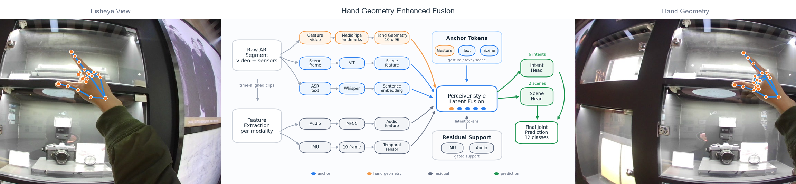
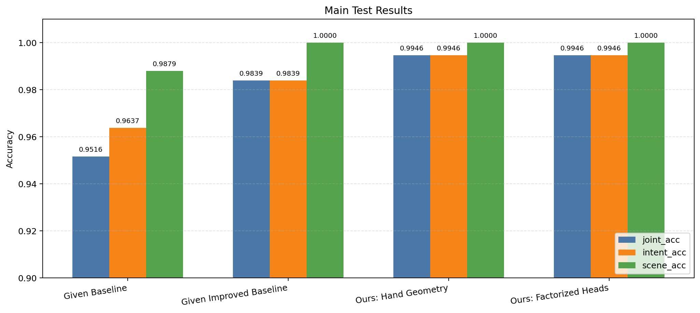
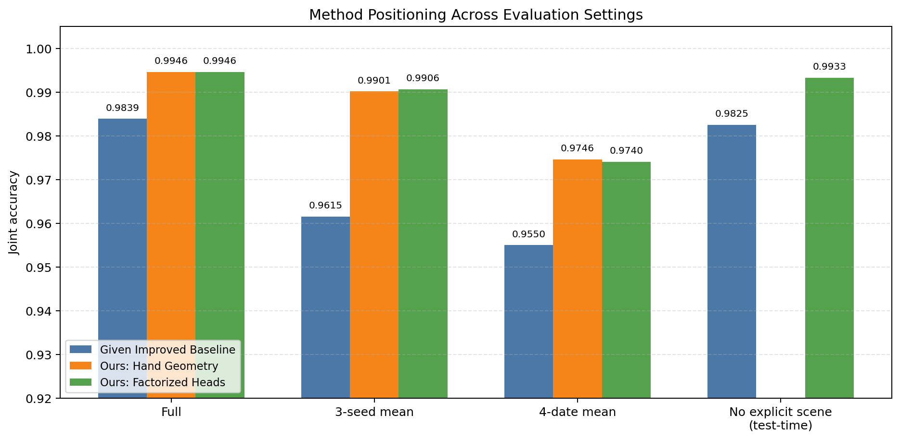
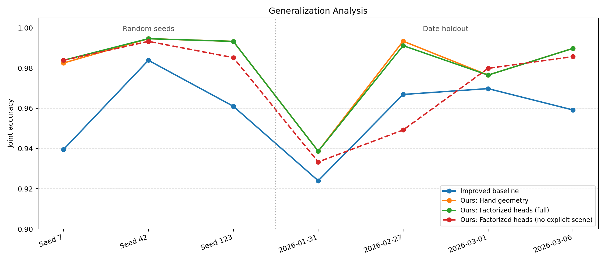
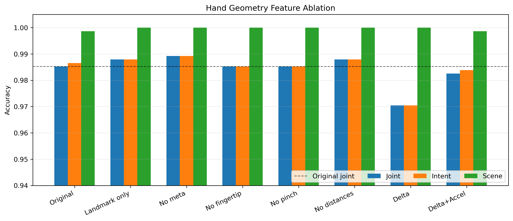
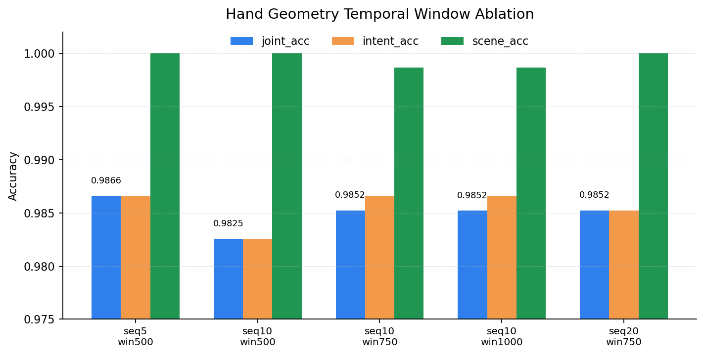

# 多模态 AR 交互意图理解

本项目面向 AR 眼镜交互场景，研究如何利用多源传感器数据识别用户交互意图。任务输入包含 IMU、手势视频、音频、ASR 文本和场景视觉五类模态，输出为 6 类意图与 2 类场景组合而成的 12 类联合标签。

项目在 Given Baseline / Given Improved Baseline 的基础上，完成了全量数据处理、特征提取、训练评估、模态缺失与噪声鲁棒性分析，并进一步引入基于 MediaPipe hand landmarks 的手部几何时序特征。该特征在主测试集和文本缺失条件下均带来了明显提升，是当前最稳定的改进方向。

## 任务定义

意图类别：

```text
menu, select, magnify, narrow, brush, cancel
```

场景类别：

```text
office, museum
```

主任务为 12 类联合分类：

```text
{office, museum} x {menu, select, magnify, narrow, brush, cancel}
```

评价指标：

| 指标 | 含义 |
|---|---|
| `joint_acc` | 场景和意图同时预测正确 |
| `intent_acc` | 只评价 6 类意图预测 |
| `scene_acc` | 只评价 2 类场景预测 |

## 数据与模态

| 模态 | 数据来源 | 特征表示 |
|---|---|---|
| IMU | HoloLens/同步传感器数据 | 10 帧时序 IMU 特征 |
| Gesture | fisheye 视频 | MediaPipe 手部检测/裁剪 + CLIP 视觉特征，或 hand landmarks 几何特征 |
| Audio | HoloLens 视频音频 | MFCC |
| Text | ASR 转写文本 | Whisper + SentenceTransformer |
| Scene | fisheye 视频 | ViT 场景视觉特征 |

特征统一对齐到检测出的交互片段，每个片段使用固定长度时序窗口。数据集和模型缓存体积较大，默认不进入 git；仓库主要保留代码、轻量图表和复现实验入口。

### 数据集划分

课程要求使用用户 A/B 作为训练数据、用户 C 作为测试数据。本项目沿用这一被试划分口径：训练与验证样本来自用户 A/B 的交互视频，测试集来自用户 C 的独立交互视频。训练阶段再从用户 A/B 样本中按固定随机种子划分验证集，因此测试集不参与早停和模型选择。

当前主实验使用 39 个主交互视频，场景包括 `office` 和 `museum`，每个场景包含 6 类意图。特征对齐后样本规模为：

| 划分 | 来源 | 样本数 | 用途 |
|---|---|---:|---|
| train | 用户 A/B | 997 | 模型参数训练 |
| val | 用户 A/B 内部划分 | 250 | early stopping / checkpoint selection |
| test | 用户 C | 744 | 最终报告指标 |

此外，泛化检查中额外跑过多随机种子和按采集日期整批留出实验，用来确认主结果不只依赖默认 seed 或单一固定测试划分。主表中的默认测试集结果仍按上述用户 C 测试集口径汇报。

## 方法概览

### Given Baseline

课程给定程序包含基础多模态分类流程：对各模态分别提取特征，按交互片段对齐后送入多模态融合网络，完成 12 类联合分类。其中手势模态本身已经使用 MediaPipe hands/HandLandmarker 定位手部区域，再对手部裁剪图提取 CLIP 视觉特征；当本地 MediaPipe 版本不兼容或模型文件缺失时，代码才会退化为整帧 CLIP fallback。

### Given Improved Baseline

Given Improved Baseline 在 Given Baseline 上加入了更强的融合结构：

- 以 Gesture / Text / Scene 作为主锚点进行融合。
- 通过 Perceiver-style latent tokens 汇聚多模态信息。
- 使用 IMU / Audio 残差辅助注入。
- 引入 modality gate、intent/scene 辅助头、gesture intent 辅助监督。
- 使用 label smoothing、dropout、weight decay、gradient clipping 等训练稳定策略。

该模型在完整测试集上已经达到较高准确率，但诊断显示它对文本语义依赖较强：当 Text 模态缺失时，性能下降明显。

### Ours: Hand Geometry

为降低模型对 ASR 文本的依赖，项目新增了基于 MediaPipe hand landmarks 的显式手部几何时序特征：

```text
code/feature_extraction/extract_hand_geometry_features.py
```

每个交互片段抽取 `(10, 96)` 维手部几何序列，包含：

- 手部是否存在、中心点、bbox 尺寸。
- 21 个 hand landmarks 的相对坐标。
- 指尖到手腕距离。
- 拇指与其他指尖的 pinch 距离。
- 掌宽、手高等尺度归一化几何量。

与给定流程中的“MediaPipe 手部裁剪 + CLIP 视觉编码”相比，Hand Geometry 不再把 landmarks 只作为裁剪依据，而是直接把关键点相对位置、尺度和指尖关系作为时序输入。因此它更关注动作轨迹和手形结构，尤其适合区分 `brush`、`magnify`、`select` 等细粒度交互动作。

### Ours: Factorized Heads

为恢复 Hand Geometry 在显式 Scene 模态缺失时的场景判别能力，进一步采用分头晚期融合：

```text
Hand Geometry checkpoint  -> intent logits
Given Improved Baseline   -> scene logits
joint logits = intent logits + scene logits
```

该方法不在输入层拼接两种手势特征，而是让几何分支负责动作意图，让原 MediaPipe-cropped CLIP 分支提供场景上下文。它是针对显式 Scene 缺失的扩展方法，主方法仍为单模型 Hand Geometry。

### Teaser 可视化



Teaser 使用 fisheye 交互画面、MediaPipe 手部骨架叠加图和中间矢量架构图组成。中间架构图概括了从原始 AR 交互片段到多模态特征提取、Anchor/Residual 融合、Perceiver-style latent fusion 以及 intent/scene/joint prediction 的完整路径。对应矢量源图保存在：

```text
docs/figures/teaser_architecture.svg
docs/figures/teaser_architecture.pdf
docs/figures/teaser_architecture.png
```

## 实验结果

### 主结果



| 模型 / 特征 | joint_acc | intent_acc | scene_acc |
|---|---:|---:|---:|
| Given Baseline | 0.9516 | 0.9637 | 0.9879 |
| Given Improved Baseline | 0.9839 | 0.9839 | 1.0000 |
| Ours: Hand Geometry | **0.9946** | **0.9946** | **1.0000** |
| Diagnostic: Factorized Heads | **0.9946** | **0.9946** | **1.0000** |

Ours: Hand Geometry 是最终主方法，在主测试集上只错 4 个样本，12 类联合分类准确率达到 `0.9946`。Diagnostic Factorized Heads 保持相同完整模态性能，但它不是部署模型，而是用 Hand Geometry 的 intent head 和 baseline 的 scene head 验证“意图证据”和“场景证据”是否可以被拆开分析。



上述两张主结果图由 `code/visualize_method_comparison.py` 生成：`main_results_methods.png` 用于总览 full-modality accuracy，`method_positioning.png` 用于区分默认测试集、重复 seed、日期留出和显式 Scene 缺失等不同协议。训练过程中自动导出的 confusion matrix 和 loss curve 仅作为诊断图；当前基础训练脚本会沿用 `Baseline Scene Perceiver-IO` 标题，因此不放入主结果段，避免和最终方法对比混淆。

### 模态缺失鲁棒性


| 缺失设置 | Given Improved Baseline | Ours: Hand Geometry | 变化 |
|---|---:|---:|---:|
| no_text | 0.4933 | **0.7675** | +0.2742 |
| no_audio_text | 0.3723 | **0.7473** | +0.3750 |
| no_imu_text | 0.4462 | **0.8091** | +0.3629 |
| no_gesture_text | 0.5672 | **0.6465** | +0.0793 |
| no_scene | **0.9785** | 0.8293 | -0.1492 |

结果说明：Hand Geometry 显著增强了文本缺失条件下的意图识别能力。即使没有 ASR 文本，模型仍能从手部轨迹中恢复大量动作信息。

需要注意的是，Hand Geometry 对 `no_scene` 条件不占优。该设置下 intent 准确率仍有 `0.9933`，但 scene 准确率下降到 `0.8333`，导致 joint 准确率降低。这说明手部几何主要增强动作意图，不替代场景识别。

### 噪声鲁棒性


| 噪声设置 | Given Improved Baseline | Ours: Hand Geometry |
|---|---:|---:|
| gesture_noise_60 | **0.9879** | 0.9772 |
| text_noise_60 | 0.9718 | **0.9946** |
| audio_noise_60 | 0.9839 | **0.9946** |
| imu_noise_60 | 0.9839 | **0.9946** |
| scene_noise_60 | 0.9839 | **0.9933** |

Ours: Hand Geometry 在大多数噪声设置下保持在 `0.99` 左右。文本高噪声下仍能保持主结果水平，进一步说明动作几何特征缓解了模型对文本模态的依赖。

### 泛化分析



| 泛化设置 | Given Improved Baseline | Ours: Hand Geometry | Ours: Factorized Heads | Factorized Heads (No Explicit Scene) |
|---|---:|---:|---:|---:|
| 3-seed mean | 0.9615 | 0.9901 | **0.9906** | 0.9875 |
| 4-date holdout mean | 0.9550 | **0.9746** | 0.9740 | 0.9620 |

随机种子和按采集日期整批留出的结果表明，Hand Geometry 的提升不只存在于默认 seed 42。日期留出中最困难的 `2026-01-31` 组 joint accuracy 为 `0.9387`，说明模型仍受采集批次、动作表现和文本分布变化影响。

Ours: Factorized Heads 使用 Hand Geometry checkpoint 的 intent head 和 Given Improved Baseline 的 scene head。它在不降低完整模态主结果的情况下，将默认 split 的 `no_scene` joint accuracy 恢复到 `0.9933`。这里的 `no_scene` 指移除显式 ViT scene feature；MediaPipe 裁剪后的 CLIP gesture 仍可能保留部分背景信息，因此该结果应解释为“显式 Scene 模态缺失鲁棒性”，而不是完全无场景视觉输入。

此外，前述模态缺失和噪声表格中的模型是在对应扰动条件下重新训练的。使用干净 checkpoint 直接面对测试时突发文本噪声时性能仍会明显下降，说明任意 test-time OOD 鲁棒性仍是后续工作。

## 尝试过程

项目中还尝试了多种模型侧和特征侧改进：

| 尝试 | 结论 |
|---|---|
| Hierarchical Margin Loss | 可作为辅助探索，但提升不稳定 |
| Focal Loss / Missing Modality Distillation | 未稳定超过 Given Improved Baseline |
| Supervised Contrastive Loss / Prototype 分类 / Ensemble | 整体收益有限 |
| ASR 文本模板增强 | 降低主任务准确率，可能稀释语义空间 |
| MediaPipe-cropped CLIP gesture + Hand Geometry 早期拼接 | 主任务降至 0.9704，不如纯 Hand Geometry |
| Ours: Hand Geometry 替换 gesture 特征 | 当前最有效，主任务 0.9946，文本缺失鲁棒性明显提升 |
| Ours: Factorized Heads | 保持完整模态性能，并恢复显式 Scene 缺失下的场景判别 |

这些结果表明，在当前数据集上继续堆叠融合头或损失函数的收益有限；更有效的方向是改进动作本身的表示，使模型获得更直接的手部轨迹证据。

## 代码结构

```text
code/
  train.py                               # 统一训练入口
  test.py                                # 测试与报告读取入口
  baseline_real_scene.py                 # baseline 训练与评估
  train_and_test.py                      # improved 训练与评估
  run_missing_experiments.py             # 模态缺失实验
  run_noise_experiments.py               # 噪声实验
  run_gesture_geometry_suite.py          # hand geometry 一键实验
  run_hand_geometry_window_ablation.py   # hand geometry 时间窗口消融
  run_gesture_fusion_suite.py            # CLIP + geometry 拼接实验
  summarize_robustness_results.py        # 鲁棒性结果汇总与可视化
  visualize_method_comparison.py         # 方法主结果、定位与泛化可视化
  feature_extraction/
    get_timestamp.py
    strong_gesture2.0.py
    extract_hand_geometry_features.py
    ASR.py
    mfcc.py
    imu.py

tools/
  draw_teaser_architecture.py            # teaser 架构图与 mockup 生成
  plot_hand_geometry_window_ablation.py  # 时间窗口消融可视化

docs/figures/
  teaser_full_mockup_with_title.png
  teaser_full_mockup.png
  teaser_architecture.svg
  teaser_architecture.pdf
  teaser_architecture.png
  hand_geometry_robustness_main.png
  hand_geometry_robustness_missing.png
  hand_geometry_robustness_noise.png
  main_results_methods.png
  method_positioning.png
  factorized_generalization.png
  hand_geometry_ablation.png
  hand_geometry_window_ablation.png
```

## 复现实验

### 端到端口径说明

本项目为了同时满足课程“端到端入口”和全量实验可复现需求，保留了四种端到端口径，报告和 README 中的结果需要按协议区分：

| 口径 | 入口 | 是否重提原始特征 | 主要用途 |
|---|---|---|---|
| workflow cached E2E | `code/train.py` | 默认复用已有缓存；可用 `--extract-features` 自动补齐缺失特征 | 正式训练/测试入口，记录模型训练与测试耗时 |
| batch E2E | `code/batch_end_to_end.py` | 默认复用缓存；加 `--raw-hand-geometry` 可对当前 batch 从 fisheye 视频现算 hand geometry | 快速证明单 batch 从数据读取到训练/测试 forward 的闭环 |
| full raw E2E | 手动串起 timestamp、gesture、MFCC、ASR、IMU、Hand Geometry、train/test | 是，从原始视频和 IMU 重新生成全部特征 | 证明完整原始流程可跑通，并估计全流程墙钟时间 |
| raw test inference | `code/raw_test_inference.py` | **是，仅对用户 C 在全新隔离目录中从头提取** | 最新课程要求的正式推理时间：raw test data 到分类标签输出 |

因此，`workflow cached E2E` 的平均样本测试时间只反映融合模型 forward，不能再作为最新要求下的正式推理时间；`batch raw Hand Geometry` 只覆盖一个模态；`full raw E2E` 的 2:01:30 又混合了训练集特征重建和重新训练。最新要求必须使用 `raw test inference`：加载既有 checkpoint，对用户 C 原始测试数据重新提取当前模型实际使用的全部特征，并计时到分类标签输出。

同理，精度对比也必须按协议比较：cached features 下比较 cached baseline 与 cached Hand Geometry；full raw E2E 下比较同一批重新提取特征得到的 full raw baseline 与 full raw Hand Geometry。不要拿 full raw Ours 去和 cached baseline 直接比较。

### Hand Geometry 主实验

```bash
python code/run_gesture_geometry_suite.py \
  --execute \
  --skip-feature-check \
  --epochs 100 \
  --patience 4
```

训练输出的 `metrics.json` 会记录课程要求的运行时间字段：

```text
runtime.train_avg_seconds_per_sample
runtime.test_avg_seconds_per_sample
runtime.train_total_seconds
runtime.test_total_seconds
```

也可以通过测试入口直接查看：

```bash
python code/test.py \
  --model improved \
  --output-dir outputs/feature_suite/hand_geometry/main
```

### 工作流级端到端

`train.py` 用于检查缓存特征、必要时执行全量特征提取，并启动完整训练评估。该入口适合正式全量重跑：

```bash
python code/train.py \
  --model improved \
  --skip-feature-check \
  --epochs 100 \
  --patience 4 \
  --batch-size 64 \
  --gesture-feature-dir dataset/AR_Data_Process3.0/data/hand_geometry_features \
  --gesture-feature-dim 96 \
  --output-dir outputs/workflow_e2e_hand_geometry
```

如需在特征缺失时自动串起特征提取，去掉 `--skip-feature-check` 并添加 `--extract-features`。当 `--gesture-feature-dir` 指向 `hand_geometry_features` 时，流程会额外生成 Hand Geometry 特征；消融变体仍建议先用 `build_hand_geometry_variants.py` 从已缓存 Hand Geometry 派生。

### Raw 测试推理计时（最新正式口径）

`raw_test_inference.py` 每次创建一个不存在的新目录，并在其中仅对用户 C 重新执行 VAD 时间戳、MFCC、Whisper + SentenceTransformer、IMU、Hand Geometry 和 ViT Scene 提取，最后加载已训练 checkpoint 输出标签。它不会读取 `dataset/AR_Data_Process3.0/data/` 中已有的测试特征，也不会重新训练模型。

```bash
python code/raw_test_inference.py \
  --checkpoint-dir outputs/feature_suite/hand_geometry/main \
  2>&1 | tee logs_raw_test_inference.txt
```

输出位于自动生成的 `outputs/raw_test_inference/<timestamp>/`：

```text
raw_inference_timing.json   # 各阶段、总墙钟、每样本推理时间与准确率
predictions.csv             # 从 fresh raw test data 得到的逐样本分类标签
features/                   # 本次运行新生成的临时测试特征
scene_cache/                # 本次运行新生成的 Scene 特征
```

正式报告使用：

```text
raw_inference_total_seconds
raw_inference_seconds_per_sample
```

`classifier_forward_seconds_per_sample` 仅作为模型 forward 的补充，不替代 raw 推理时间。脚本默认只提取 Hand Geometry，而不提取已被最终模型替换掉的 CLIP Gesture，因为正式推理时间应覆盖当前部署模型实际使用的计算路径。

### Batch 级端到端

`batch_end_to_end.py` 是独立的 batch 级闭环检查，不会触发全量训练。默认复用已有缓存特征，统计缓存加载、单 batch 训练 step 和单 batch 测试 forward 的平均样本时间：

```bash
python code/batch_end_to_end.py \
  --model improved \
  --hand-geometry \
  --batch-size 32 \
  --output-dir outputs/batch_e2e_hand_geometry
```

如果要单独评估当前 batch 从 fisheye 原视频现算 MediaPipe hand geometry 的耗时，可加：

```bash
python code/batch_end_to_end.py \
  --model improved \
  --hand-geometry \
  --raw-hand-geometry \
  --allow-raw-fallback \
  --batch-size 32 \
  --output-dir outputs/batch_e2e_hand_geometry_raw
```

### 历史端到端计时结果

服务器环境为 NVIDIA RTX 5880 Ada，batch size 为 64。正式工作流级端到端使用已缓存的 Hand Geometry 特征，主要统计模型训练与测试阶段耗时；batch 级 raw 结果额外统计当前 batch 从 fisheye 原视频现算 MediaPipe hand geometry 的耗时。

| 设置 | 样本数 | 平均样本训练时间 | 平均样本测试时间 | 特征相关耗时 |
|---|---:|---:|---:|---:|
| workflow cached Hand Geometry | train seen 16949 / test 744 | 0.000434 s | 0.000127 s（仅 forward） | 使用缓存特征，不满足最新推理口径 |
| batch cached Hand Geometry | 32 | 0.015178 s | 0.000806 s | cache load 0.000480 s/sample |
| batch raw Hand Geometry | 32 | 0.013226 s | 0.000729 s | raw geometry 1.758790 s/sample |
| full raw workflow | train seen 10967 / test 744 | 0.000436 s | 0.000126 s | total wall time 2:01:30 |
| raw test inference | 用户 C fresh raw test | 训练时间不变 | **待服务器运行新入口回填** | 禁止调用既有测试特征缓存 |

对应完整模态测试结果：

| 模型 | joint_acc | intent_acc | scene_acc | best_epoch |
|---|---:|---:|---:|---:|
| Ours: Hand Geometry workflow E2E | 0.9946 | 0.9946 | 1.0000 | 13 |
| Ours: Hand Geometry full raw E2E | 0.9852 | 0.9866 | 0.9987 | 7 |

需要注意：上表前三行均为历史诊断口径。按照最新要求，正式“推理时间”只能使用最后一行 raw test inference 的结果；训练时间仍沿用原统计，无需修改。

Full raw workflow 从原始数据重新执行 timestamp、MediaPipe-cropped CLIP gesture、MFCC、ASR、IMU、Hand Geometry 与训练测试。总墙钟时间为 2:01:30，其中主要耗时来自 `strong_gesture2.0.py` 约 60 分钟和 `extract_hand_geometry_features.py` 约 55 分钟。

公平比较需要区分固定缓存特征协议和重新提取原始特征协议：

| 协议 | Given Improved Baseline | Ours: Hand Geometry | 提升 |
|---|---:|---:|---:|
| cached features | 0.9839 | 0.9946 | +0.0107 |
| full raw E2E | 0.9530 | 0.9855 mean / 0.9879 best | +0.0325 / +0.0349 |

### Hand Geometry 消融



为分析 Hand Geometry 改进模块内部各特征组的贡献，基于同一批 full raw 重新提取后的手部几何缓存派生特征变体，并保持训练协议一致。

| 变体 | 说明 | joint_acc | intent_acc | scene_acc |
|---|---|---:|---:|---:|
| original | 原始 96 维 Hand Geometry | 0.9852 | 0.9866 | 0.9987 |
| landmark_only | 仅保留 wrist-relative landmarks | 0.9879 | 0.9879 | 1.0000 |
| no_meta | 去掉检测框/中心/尺度等 meta | **0.9892** | **0.9892** | 1.0000 |
| no_fingertip | 去掉 fingertip-to-wrist 距离 | 0.9852 | 0.9852 | 1.0000 |
| no_pinch | 去掉 pinch 距离 | 0.9852 | 0.9852 | 1.0000 |
| no_distances | 去掉 fingertip 与 pinch 距离 | 0.9879 | 0.9879 | 1.0000 |
| delta | 拼接一阶时序差分 | 0.9704 | 0.9704 | 1.0000 |
| delta_accel | 拼接一阶与二阶差分 | 0.9825 | 0.9839 | 0.9987 |

结果显示，当前数据集上 wrist-relative landmarks 已经包含主要动作判别信息；meta 和显式距离组并非不可或缺，去掉 meta 反而略有提升。直接拼接时序差分会明显降低准确率，说明在小样本且文本锚点较强的设置下，高维差分特征可能引入噪声，简单速度扩展不如稳定的归一化关键点几何。

### Hand Geometry 时间窗口消融



为检查手部几何特征对采样帧数和时间窗口长度的敏感性，额外重跑了 5 组 MediaPipe Hand Geometry 提取与训练：

| 设置 | seq_len | half_window_ms | window_ms | joint_acc | intent_acc | scene_acc |
|---|---:|---:|---:|---:|---:|---:|
| seq5_win500 | 5 | 500 | 1000 | **0.9866** | **0.9866** | 1.0000 |
| seq10_win500 | 10 | 500 | 1000 | 0.9825 | 0.9825 | 1.0000 |
| seq10_win750 | 10 | 750 | 1500 | 0.9852 | **0.9866** | 0.9987 |
| seq10_win1000 | 10 | 1000 | 2000 | 0.9852 | 0.9865 | 0.9987 |
| seq20_win750 | 20 | 750 | 1500 | 0.9852 | 0.9852 | 1.0000 |

结果表明，Hand Geometry 对时间窗口选择较稳定，主任务准确率集中在 `0.9825-0.9866`。较短的 `seq5_win500` 略高，但差距很小，因此更适合作为“时间窗口鲁棒性”证据，而不是强调单一窗口配置显著最优。

### Hand Geometry 鲁棒性实验

```bash
python code/run_missing_experiments.py \
  --model improved \
  --output-model-name hand_geometry \
  --max-missing 2 \
  --epochs 100 \
  --patience 4 \
  --gesture-feature-dir dataset/AR_Data_Process3.0/data/hand_geometry_features \
  --gesture-feature-dim 96 \
  --skip-feature-check \
  --execute

python code/run_noise_experiments.py \
  --model improved \
  --output-model-name hand_geometry \
  --epochs 100 \
  --patience 4 \
  --gesture-feature-dir dataset/AR_Data_Process3.0/data/hand_geometry_features \
  --gesture-feature-dim 96 \
  --skip-feature-check \
  --execute
```

### 汇总与可视化

```bash
python code/summarize_robustness_results.py \
  --models improved hand_geometry
```

输出：

```text
outputs/summary/robustness_summary.csv
outputs/summary/robustness_summary.md
outputs/summary/robustness_main.png
outputs/summary/robustness_missing.png
outputs/summary/robustness_noise.png
```

## 环境说明

实验主要在 GPU 服务器上运行。模型、数据集视频、特征缓存、训练权重和完整日志体积较大，默认不纳入 git。仓库中保留的 `docs/figures/` 是轻量可视化结果，用于快速查看主要实验结论。
