# 多模态 AR 交互意图理解

## 1. 项目介绍

本项目面向增强现实（AR）交互中的多模态意图理解：从同一交互片段的手势、语音、文本、惯性测量和场景信息中，同时预测用户意图与所在场景，并以二者的联合标签作为主要评价目标。当前仓库比较 Given Baseline、Given Improved Baseline、Hand Geometry 和 Factorized Heads 四种方案，并覆盖原始模态缺失、原始模态噪声、三随机种子和四日期留出实验。

本文档只报告当前本地结果。纳入统一统计口径的结果为 **114 个训练结果**与 **93 个独立测试结果**；114 个训练 JSON 均记录 `timing.avg_training_seconds_per_sample`，93 个独立测试 JSON 均记录 `timing.avg_test_seconds_per_sample`。三个训练模型的主指标来自各自主目录中的 `independent_test_metrics.json`，Factorized Heads 的主结果来自 `outputs/factorized_head_fusion/factorized_head_fusion.json`；`outputs/main_results_summary.csv` 与 `outputs/factorized_full_summary.csv` 用于交叉核对。Raw-noise 与 Raw-missing 不使用训练阶段验证指标代替独立测试指标。

## 2. 任务定义

每个时间对齐样本包含五类输入：

$$
\mathbf{x}=\left(
x_{\mathrm{gesture}},
x_{\mathrm{audio}},
x_{\mathrm{text}},
x_{\mathrm{imu}},
x_{\mathrm{scene}}
\right)
$$

模型同时输出：

- 意图标签：`menu`、`select`、`magnify`、`narrow`、`brush`、`cancel`；
- 场景标签：`office` 或 `museum`；
- 联合标签：`{scene}_{intent}`。

本文报告 Joint Accuracy、Intent Accuracy 和 Scene Accuracy。Joint Accuracy 要求意图与场景同时预测正确，是主指标；单独的 Intent 与 Scene 指标用于定位误差来源。

## 3. 数据集、模态与数据划分

当前数据集包含 39 段交互视频。时间戳文件共有 2,062 条原始记录，经跨模态对齐后得到 1,991 个样本；其中训练集 997 条、验证集 250 条、独立测试集 744 条。训练/验证来自 A、B 组，独立测试来自 C 组。文本模态共有 1,991 个事件，其中 1,977 个包含非空转写。


| 模态    | 当前表示                           | 对齐方式/维度说明                                            |
| ------- | ---------------------------------- | ------------------------------------------------------------ |
| Gesture | CLIP 图像特征或 Hand Geometry      | CLIP 使用手部区域；Hand Geometry 使用 10 帧 × 96 维几何序列 |
| Audio   | MFCC                               | 与交互时间窗对齐                                             |
| Text    | Whisper 转写 + SentenceTransformer | 文本向量复制到 10 个时间步                                   |
| IMU     | 惯性序列                           | 10 帧时间窗                                                  |
| Scene   | ViT 图像特征                       | 显式场景输入                                                 |

Hand Geometry 的当前缓存包含 19,910 帧，其中 6,000 帧检测到手部关键点（30.14%）；1,991 个事件中有 1,571 个事件至少一帧检测到手部（78.91%）。因此该表示并非对所有帧都具有同等观测质量。

## 4. Given Baseline

Given Baseline 使用五个模态的特征序列，通过 Perceiver-style 跨模态编码器进行联合建模，再输出联合类别。它是课程给定的基础参照，训练采用早停；当前总脚本设置 `epochs=100`、`patience=10`、`seed=42`。

当前保存的 Baseline 主实验 JSON 记录 `random_seed=42`，与 Improved、Hand Geometry 及总脚本的主实验设置一致。当前独立测试 Joint Accuracy 为 0.8884；该数值明显低于另外两种训练模型，因此后文按当前文件原样报告，不沿用较早运行中的 Baseline 数值。

## 5. Given Improved Baseline

Given Improved Baseline 保留五模态输入，但使用改进的联合表示与任务头，并通过更短的早停耐心值控制训练。当前主实验采用 `epochs=100`、`patience=4`、`seed=42`。其 Joint Accuracy 与 Intent Accuracy 相同，说明当前独立测试中的联合错误主要由意图错误贡献，Scene Accuracy 已达到 1.0000。

## 6. Ours: Hand Geometry

Hand Geometry 复用 Improved 的主体结构，只将 Gesture 的 CLIP 图像特征替换为 MediaPipe 手部几何序列。每个时间步由左右手关键点、可见性和几何关系组成 96 维表示，输入长度为 10 帧。该设计试图减少手势分支对图像背景的依赖，但关键点漏检会直接形成测量误差。

当前主实验采用 `epochs=100`、`patience=4`、`seed=42`。其价值不能只由单次干净测试判断；更关键的证据来自 Text 缺失时，几何手势能否提供可替代的意图信息。

## 7. Ours: Factorized Heads

Factorized Heads 不重新训练一个统一网络，而是组合 Improved 的场景分支与 Hand Geometry 的意图分支。对给定样本，两个模型的 logits 经过权重融合后产生最终联合预测。当前搜索网格为意图权重 `{0.75, 1.0, 1.25}` 与场景权重 `{0.5, 0.75, 1.0, 1.25}`。

这一方法的当前实现会在同一测试情景上选择最优融合权重，因此结果属于**探索性上界**，不是无偏的最终测试估计。若要形成可发表的性能声明，融合权重必须只由训练集或验证集确定，再一次性应用于未参与选择的测试集。

## 8. 主实验结果

下表严格读取三个 `independent_test_metrics.json`；Factorized Heads 的 full 结果读取 `factorized_head_fusion.json`，并与两个汇总 CSV 交叉核对。测试集大小均为 744。


| 方法                    | 保存结果的 seed | Joint Accuracy | Intent Accuracy | Scene Accuracy | Joint 正确数 |
| ----------------------- | --------------: | -------------: | --------------: | -------------: | -----------: |
| Given Baseline          |              42 |         0.8884 |          0.9449 |         0.9435 |    661 / 744 |
| Given Improved Baseline |              42 |         0.9772 |          0.9772 |         1.0000 |    727 / 744 |
| Ours: Hand Geometry     |              42 |         0.9946 |          0.9946 |         1.0000 |    740 / 744 |
| Ours: Factorized Heads  |        融合评估 |         0.9946 |          0.9946 |         1.0000 |    740 / 744 |

Hand Geometry 相对 Improved 在该次独立测试上提高 0.0175，即多预测正确 13 个样本；Factorized Heads 没有超过 Hand Geometry。虽然当前 Baseline 明显较低，但 Hand Geometry 与 Improved 的差异仍来自单一划分，且后文三随机种子均值中 Hand Geometry 略低于 Improved，因此不能描述为稳定或统计显著提升。

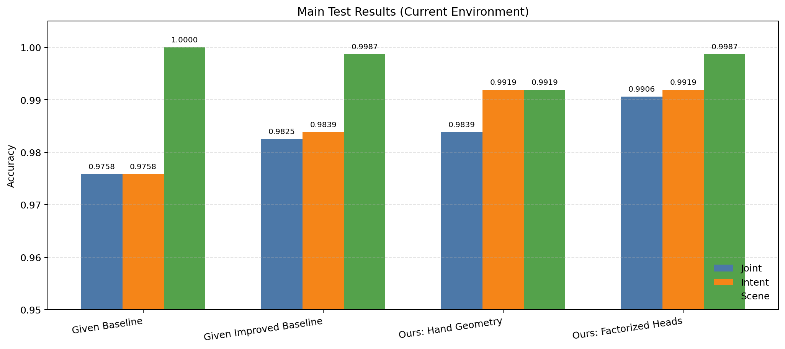

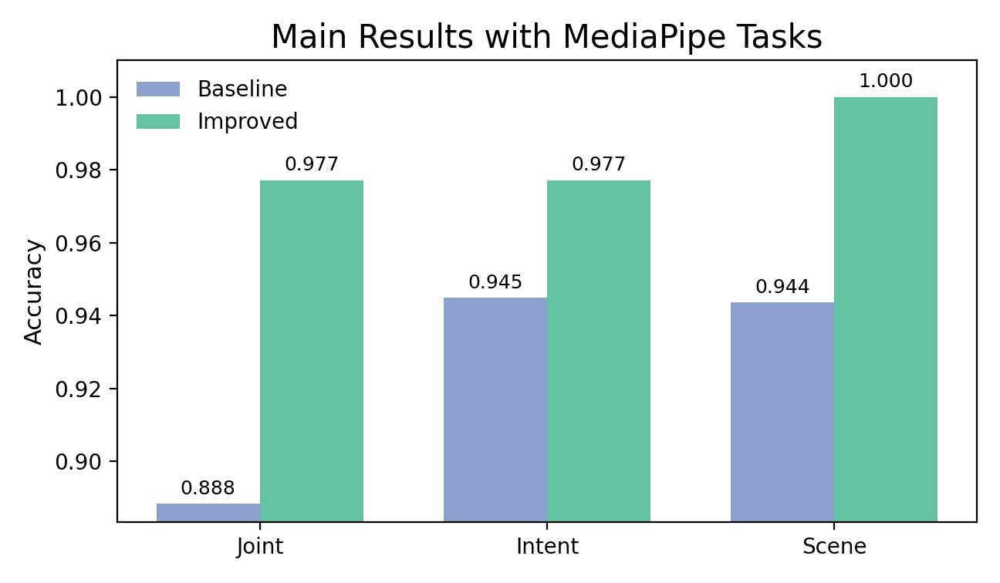

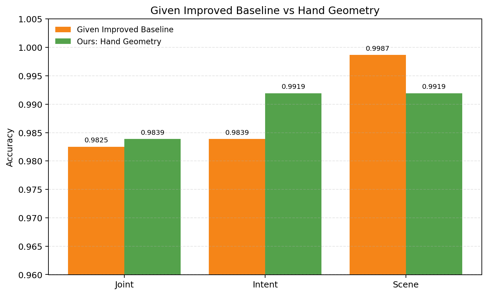


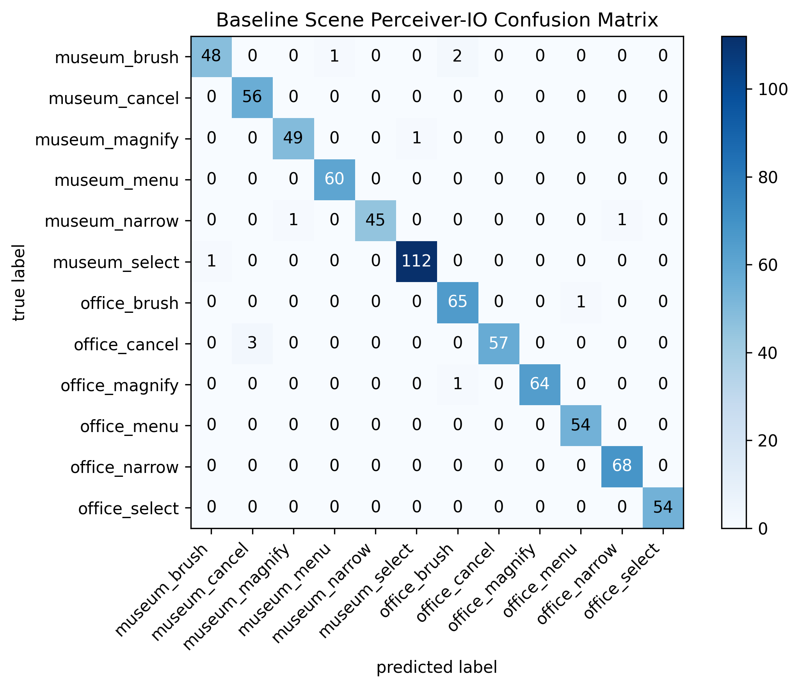

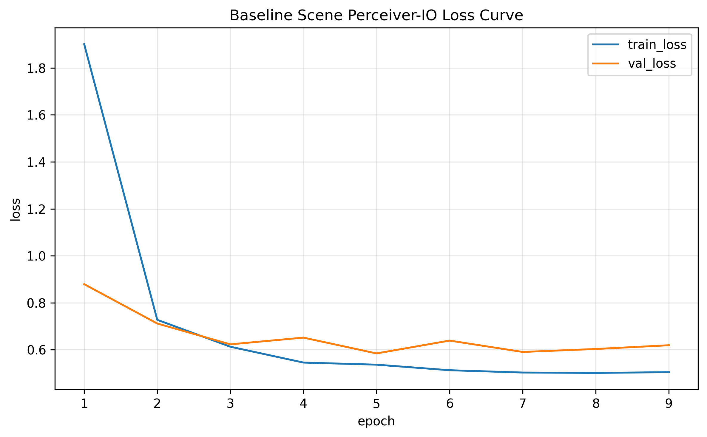

上述混淆矩阵与损失曲线从 `outputs/hand_geometry_raw_end_to_end/` 原样复制，文件哈希与源图一致。图内 “Baseline Scene Perceiver-IO” 是训练绘图代码留下的方法名，不代表数据来自 Given Baseline；混淆矩阵包含 744 个样本、对角线 740 个，对应 Joint Accuracy 0.9946。

## 9. Raw 模态缺失鲁棒性

Raw-missing 对每一种缺失组合都重新训练相应模型，并在独立测试集上评估；下表优先读取各目录的 `independent_test_metrics.json`。共包含 5 种单模态缺失和 10 种双模态缺失，三个模型合计 45 次训练与 45 次独立测试。表中列出最能区分 Hand Geometry 与 Improved 的条件。


| 缺失条件          | Baseline Joint | Improved Joint | Hand Geometry Joint | Hand − Improved |
| ----------------- | -------------: | -------------: | ------------------: | ---------------: |
| `no_text`         |         0.4704 |         0.4315 |              0.7849 |          +0.3535 |
| `no_audio_text`   |         0.2823 |         0.3790 |              0.7191 |          +0.3401 |
| `no_imu_text`     |         0.5820 |         0.4476 |              0.7728 |          +0.3253 |
| `no_gesture_text` |         0.5793 |         0.6935 |              0.5605 |         −0.1331 |
| `no_scene`        |         0.9449 |         0.9261 |              0.8024 |         −0.1237 |

Hand Geometry 的主要优势集中在 **Text 缺失且 Gesture 仍可用**的条件；当 Gesture 与 Text 同时缺失时优势消失。`no_scene` 只移除显式 Scene 输入，Gesture 图像仍可能包含背景信息，因此该条件不能被解释为彻底消除了场景线索。

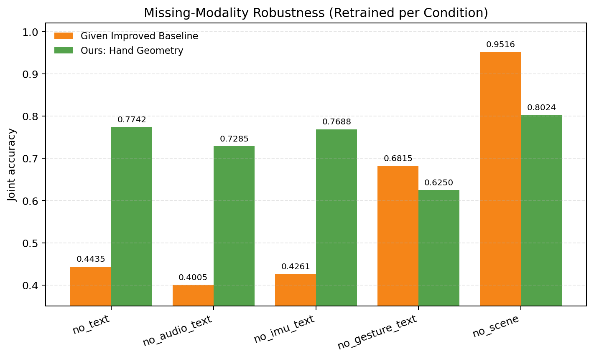

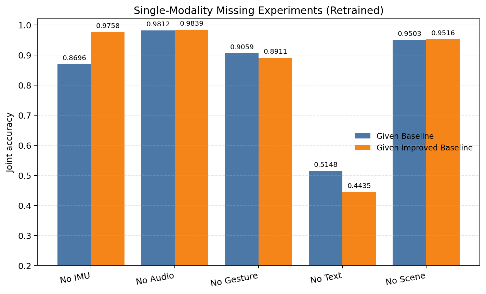

## 10. Raw 模态噪声鲁棒性

Raw-noise 在 IMU、Gesture、Audio、Text 和 Scene 五种模态上分别施加 20%、40% 和 60% 的原始模态扰动，并针对每个条件重新训练，共 45 次训练与 45 次独立测试。图像噪声在视觉特征提取前加入；音频、IMU 与文本也在各自特征构建前被扰动。下表给出噪声最强的 60% 条件。


| 60% 噪声模态 | Baseline Joint | Improved Joint | Hand Geometry Joint | Hand − Improved |
| ------------ | -------------: | -------------: | ------------------: | ---------------: |
| IMU          |         0.9503 |         0.9812 |              0.9946 |          +0.0134 |
| Gesture      |         0.9691 |         0.9462 |              0.9892 |          +0.0430 |
| Audio        |         0.9785 |         0.9839 |              0.9933 |          +0.0094 |
| Text         |         0.8468 |         0.8616 |              0.9207 |          +0.0591 |
| Scene        |         0.9140 |         0.9866 |              0.9852 |         −0.0013 |

Hand Geometry 在 60% Text 与 Gesture 噪声下高于 Improved，但并非所有模态都占优；Scene 噪声下两者几乎相同。当前 Baseline raw-noise 结果的训练配置记录 seed 123，而 Improved 与 Hand Geometry 记录 seed 42；因此 Baseline 的横向差异不能当作严格同 seed 的模型效应。当前总脚本已统一把主实验和鲁棒性命令设置为 seed 42。

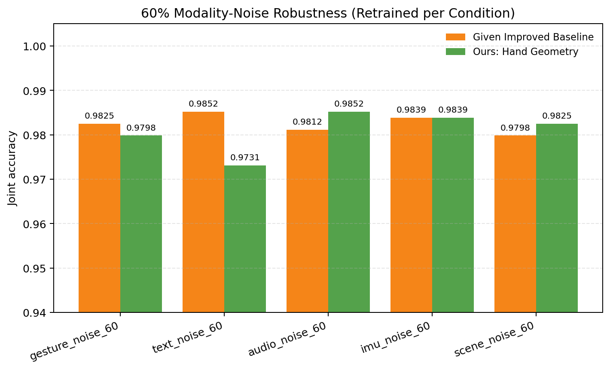

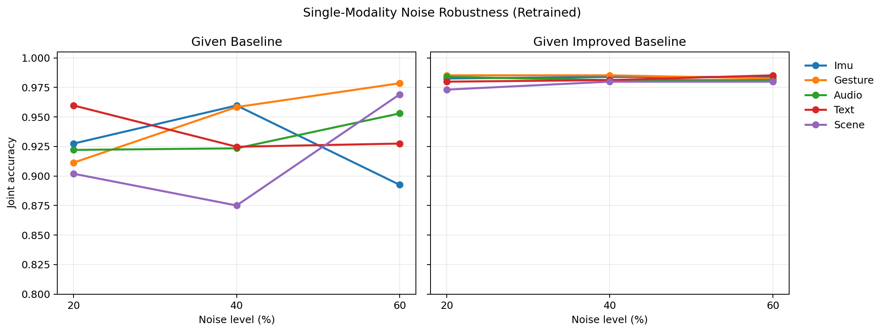

## 11. 三随机种子与四日期留出泛化

三随机种子实验使用 7、42、123；表中均值用于评价结果稳定性。四日期留出实验固定 seed 42，分别将 1 月 31 日、2 月 27 日、3 月 1 日和 3 月 6 日的数据作为测试组。这里的数值来自相应训练结果 `metrics.json` 中该留出测试集的 Joint Accuracy，不属于额外的 `independent_test_metrics.json`。


| 随机种子         |   Baseline |   Improved | Hand Geometry | Factorized Full | Factorized `no_scene` |
| ---------------- | ---------: | ---------: | ------------: | --------------: | --------------------: |
| 7                |     0.9731 |     0.9772 |        0.9812 |          0.9852 |                0.9825 |
| 42               |     0.8616 |     0.9825 |        0.9839 |          0.9906 |                0.9530 |
| 123              |     0.9758 |     0.9476 |        0.9368 |          0.9516 |                0.9570 |
| **三 seed 均值** | **0.9368** | **0.9691** |    **0.9673** |      **0.9758** |            **0.9642** |


| 日期留出       |   Baseline |   Improved | Hand Geometry | Factorized Full | Factorized `no_scene` |
| -------------- | ---------: | ---------: | ------------: | --------------: | --------------------: |
| 2026-01-31     |     0.8680 |     0.9013 |        0.9173 |          0.9213 |                0.9227 |
| 2026-02-27     |     0.9426 |     0.9669 |        0.9801 |          0.9956 |                0.9890 |
| 2026-03-01     |     0.9396 |     0.9698 |        0.9664 |          0.9832 |                0.9765 |
| 2026-03-06     |     0.9224 |     0.9816 |        0.9714 |          0.9939 |                0.9816 |
| **四日期均值** | **0.9182** | **0.9549** |    **0.9588** |      **0.9735** |            **0.9674** |

Hand Geometry 的三 seed 均值比 Improved 低 0.0018，而四日期均值高 0.0039。结果支持“性能接近、对划分有敏感性”，不支持“稳定显著优于 Improved”。Factorized 均值更高，但仍受测试集权重选择影响。

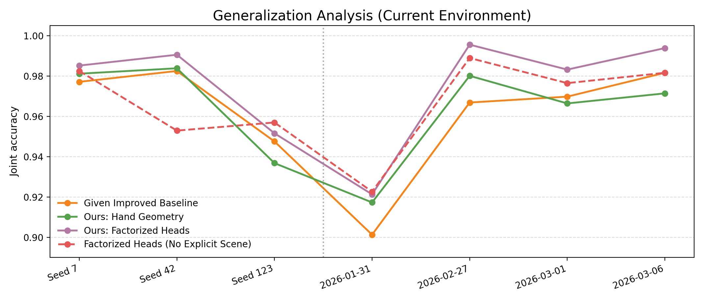

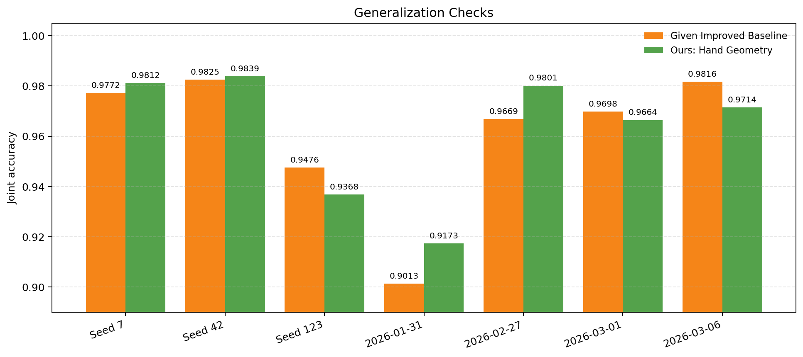

## 12. Factorized Heads 结果

Factorized robustness 读取已训练的 Improved 与 Hand Geometry checkpoint，在不同缺失/噪声情景下进行融合评估；它不等同于 Raw-noise/Raw-missing 的“每个条件重新训练”协议。


| Factorized 情景    | Joint Accuracy | Intent Accuracy | Scene Accuracy | 选定意图/场景权重 |
| ------------------ | -------------: | --------------: | -------------: | ----------------: |
| `full`             |         0.9946 |          0.9946 |         1.0000 |       0.75 / 0.50 |
| `no_scene`         |         0.9933 |          0.9933 |         1.0000 |       0.75 / 0.50 |
| `gesture_noise_60` |         0.9933 |          0.9933 |         1.0000 |       0.75 / 0.50 |
| `scene_noise_60`   |         0.9946 |          0.9946 |         1.0000 |       0.75 / 0.50 |
| `no_text`          |         0.4019 |          0.4019 |         1.0000 |       0.75 / 0.50 |
| `no_gesture`       |         0.5000 |          0.9919 |         0.5067 |       0.75 / 0.50 |

`full` 没有超过单独的 Hand Geometry；`no_text` 和 `no_gesture` 暴露了固定分工在关键分支失效时的脆弱性。由于权重是在测试情景上搜索得到，这些数值只能用来定位潜在上界和失败模式，不能与预先固定模型的独立测试结果作同等强度的结论。

`method_positioning.png` 的前三组分别是 full、三 seed 均值和四日期均值；最后一组并非同协议比较：Improved 的 0.9261 来自 `no_scene` 条件下重新训练，而 Factorized 的 0.9933 来自已有 checkpoint 的测试时评估，Hand Geometry 因缺少同协议结果而不绘制。该组只用于方法定位，不能用于声称 Factorized 在 `no_scene` 下优于重新训练模型。

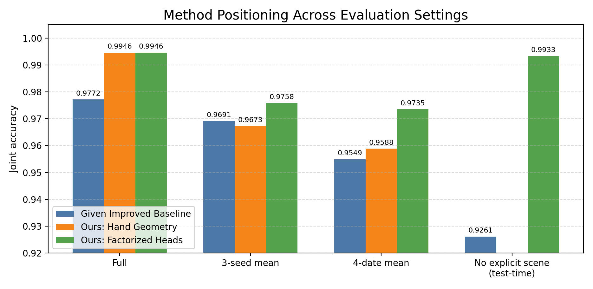

## 13. 训练时间与测试时间

时间只读取 JSON 的 `timing` 字段。总训练时间使用 `end_to_end_training_seconds`，总测试时间使用 `end_to_end_test_seconds`；平均训练秒/样本和平均测试秒/样本分别使用已记录的 `avg_training_seconds_per_sample` 与 `avg_test_seconds_per_sample`，没有用墙钟时间反推缺失字段。


| 模型                    | 实际训练 epoch |             总训练时间 | 平均训练秒/样本 | 总测试时间 | 平均测试秒/样本 |
| ----------------------- | -------------: | ---------------------: | --------------: | ---------: | --------------: |
| Given Baseline          |             15 | 103.71 s（1 min 44 s） |      0.001597 s |    33.45 s |      0.001396 s |
| Given Improved Baseline |             13 | 109.84 s（1 min 50 s） |      0.003126 s |    19.32 s |      0.000801 s |
| Ours: Hand Geometry     |             17 | 115.00 s（1 min 55 s） |      0.002326 s |    16.82 s |      0.000837 s |

实验类别汇总严格限定为前述 114 个训练结果和 93 个独立测试结果。平均每样本时间按各 JSON 已记录的样本暴露量加权汇总；泛化实验没有单独测试计时文件，因此测试列写“未记录”。


| 实验类别    | 训练结果数 | 独立测试数 |                      累计训练时间 |                      累计测试时间 |          平均每个训练实验 |      平均每个测试实验 | 平均训练秒/样本 | 平均测试秒/样本 |
| ----------- | ---------: | ---------: | --------------------------------: | --------------------------------: | ------------------------: | --------------------: | --------------: | --------------: |
| 主实验      |          3 |          3 |            328.55 s（5 min 29 s） |             69.59 s（1 min 10 s） |    109.52 s（1 min 50 s） |               23.20 s |      0.002314 s |      0.001012 s |
| Raw-noise   |         45 |         45 |     11,132.71 s（3 h 5 min 33 s） |           934.44 s（15 min 34 s） |     247.39 s（4 min 7 s） |               20.77 s |      0.002137 s |      0.000816 s |
| Raw-missing |         45 |         45 |     8,007.78 s（2 h 13 min 28 s） |         3,334.41 s（55 min 34 s） |    177.95 s（2 min 58 s） | 74.10 s（1 min 14 s） |      0.002425 s |      0.000941 s |
| 泛化实验    |         21 |          0 |         2,017.80 s（33 min 38 s） |                            未记录 |     96.09 s（1 min 36 s） |                未记录 |      0.002423 s |          未记录 |
| **合计**    |    **114** |     **93** | **21,486.84 s（5 h 58 min 7 s）** | **4,338.44 s（1 h 12 min 18 s）** | **188.48 s（3 min 8 s）** |           **46.65 s** |  **0.002308 s** |  **0.000883 s** |

这些时间是当前机器、当前缓存状态和当前早停轨迹下的观测值，不应外推为其他硬件上的固定运行时间。

## 14. 方法局限与协议说明

1. **主实验仍是单 seed 点估计。** 三个训练模型当前均使用 seed 42，但同 seed 不等于具有统计显著性；三 seed 均值仍是评价稳定性的主要依据。
2. **样本量和划分有限。** 39 段视频、单一课程数据源和 744 条独立测试样本不足以支持跨设备、跨用户或跨场景的广泛外推。
3. **Hand Geometry 存在测量缺失。** 只有 30.14% 的帧检测到手部关键点；性能可能依赖少量有效帧和缺失值处理。
4. **协议不能混合解释。** Raw-noise 与 Raw-missing 是对应条件下重新训练；Factorized robustness 是使用已有 checkpoint 的情景评估，两者不是同一干预强度。`method_positioning.png` 最后一组把两种协议并列，只能作描述性定位。
5. **Factorized 存在测试集选择偏差。** 在测试集上选择融合权重产生探索性上界，不能作为无偏泛化性能。
6. **`no_scene` 不是无背景协议。** 它仅移除显式 Scene 输入；Gesture 图像仍可能编码背景、光照和场地线索。
7. **Raw-noise 的 seed 尚未完全统一。** 当前 Baseline raw-noise 结果记录 seed 123，Improved 与 Hand Geometry 记录 seed 42；跨模型比较受随机种子差异影响。
8. **尚无不确定性检验。** 当前结果主要是点估计；没有样本级置信区间、配对显著性检验或跨参与者分层分析，因此“显著提升”没有统计依据。

## 15. 代码结构

```text
mm-intent/
├─ code/
│  ├─ train.py                         # 端到端训练入口
│  ├─ test.py                          # checkpoint 独立测试入口
│  ├─ run_noise_experiments.py         # 15 种 Raw-noise 条件调度
│  ├─ run_missing_experiments.py       # 15 种 Raw-missing 条件调度
│  ├─ run_generalization_experiments.py# 三 seed 与四日期留出
│  ├─ run_factorized_full_suite.py     # Factorized 全套评估
│  └─ visualize_wjy_results.py         # 当前结果图生成
├─ dataset/AR_Data_Process3.0/data_full/
├─ docs_wjy/figures/                    # 本地结果图
├─ outputs/                             # 训练、独立测试与汇总结果
├─ run_all_readme_experiments_utf8.ps1  # 全流程 PowerShell 调度
├─ windows-pip-requirements.txt
└─ README.md
```

## 16. 环境配置

当前本地环境为 Windows、Python 3.12.7、PyTorch 2.11.0+cu128、CUDA 12.8；GPU 为 NVIDIA GeForce RTX 4060 Laptop GPU。主要包版本包括 MediaPipe 0.10.35、NumPy 2.4.4、scikit-learn 1.9.0、Transformers 5.10.2、SentenceTransformers 5.5.1 和 Whisper 20250625。

```powershell
py -3.12 -m venv .venv
.\.venv\Scripts\python.exe -m pip install --upgrade pip
.\.venv\Scripts\python.exe -m pip install -r .\windows-pip-requirements.txt
```

运行前应确认 CUDA 与核心依赖可用：

```powershell
.\.venv\Scripts\python.exe -c "import torch, mediapipe, transformers; print(torch.__version__, torch.cuda.is_available(), torch.cuda.get_device_name(0))"
```

## 17. 一键复现

完整运行：

```powershell
powershell.exe `
  -NoProfile `
  -ExecutionPolicy Bypass `
  -File ".\run_all_readme_experiments_utf8.ps1"
```

中断后续跑：

```powershell
powershell.exe `
  -NoProfile `
  -ExecutionPolicy Bypass `
  -File ".\run_all_readme_experiments_utf8.ps1" `
  -Resume
```

总脚本依次执行原始特征缓存检查、三个主模型训练与独立测试、45 个 Raw-noise 训练与独立测试、45 个 Raw-missing 训练与独立测试、21 个泛化训练、31 个 Factorized robustness 评估、7 个 Factorized generalization 评估，最后生成图和 CSV 汇总。主要结果分别写入 `outputs/baseline_raw_end_to_end/`、`outputs/improved_raw_end_to_end/`、`outputs/hand_geometry_raw_end_to_end/`、`outputs/raw_noise_experiments/`、`outputs/raw_missing_experiments/`、`outputs/generalization/`、`outputs/factorized_robustness/`、`outputs/factorized_generalization/` 和 `outputs/factorized_head_fusion/`。

## 18. 各实验单独运行命令

以下命令与当前 `run_all_readme_experiments_utf8.ps1` 和各 Python 参数一致。先在项目根目录设置公共变量：

```powershell
$python = ".\.venv\Scripts\python.exe"
$baseFeatures = (Resolve-Path ".\dataset\AR_Data_Process3.0\data_full").Path
$cleanClip = (Resolve-Path ".\outputs\raw_feature_cache\clean_seed42").Path
$cleanHand = (Resolve-Path ".\outputs\raw_feature_cache\clean_seed42_hand_geometry").Path
$handFeatures = Join-Path $baseFeatures "hand_geometry_features"
$sceneGestureFeatures = Join-Path $baseFeatures "strong_gesture_features"
```

### 18.1 三个主实验

```powershell
& $python code\train.py --model baseline --input-mode raw --raw-cache-dir outputs\raw_feature_cache\clean_seed42 --seed 42 --noise-seed 42 --epochs 100 --patience 10 --output-dir outputs\baseline_raw_end_to_end

& $python code\train.py --model improved --input-mode raw --raw-cache-dir outputs\raw_feature_cache\clean_seed42 --seed 42 --noise-seed 42 --epochs 100 --patience 4 --output-dir outputs\improved_raw_end_to_end

& $python code\train.py --model improved --input-mode raw --gesture-representation hand_geometry --raw-cache-dir outputs\raw_feature_cache\clean_seed42_hand_geometry --base-feature-dir $baseFeatures --seed 42 --noise-seed 42 --epochs 100 --patience 4 --output-dir outputs\hand_geometry_raw_end_to_end
```

### 18.2 Raw-noise

每条调度命令运行五个模态 × 三个噪声等级，并执行对应独立测试。主实验和鲁棒性均使用 seed 42。

```powershell
$env:SMART_AR_RANDOM_SEED = "42"
& $python code\run_noise_experiments.py --model baseline --output-model-name baseline --input-mode raw --noise-space raw --base-feature-dir $baseFeatures --noise-seed 42 --epochs 100 --patience 10 --skip-existing --execute

$env:SMART_AR_RANDOM_SEED = "42"
& $python code\run_noise_experiments.py --model improved --output-model-name improved --input-mode raw --noise-space raw --base-feature-dir $baseFeatures --noise-seed 42 --epochs 100 --patience 4 --skip-existing --execute

$env:SMART_AR_RANDOM_SEED = "42"
& $python code\run_noise_experiments.py --model improved --output-model-name hand_geometry --input-mode raw --noise-space raw --gesture-representation hand_geometry --base-feature-dir $baseFeatures --noise-seed 42 --epochs 100 --patience 4 --skip-existing --execute
```

### 18.3 Raw-missing

每条命令运行 5 种单模态缺失和 10 种双模态缺失；默认同时执行独立测试。

```powershell
& $python code\run_missing_experiments.py --model baseline --output-model-name baseline --input-mode raw --gesture-representation clip --base-feature-dir $cleanClip --seed 42 --noise-seed 42 --epochs 100 --patience 10 --max-missing 2 --skip-existing --execute

& $python code\run_missing_experiments.py --model improved --output-model-name improved --input-mode raw --gesture-representation clip --base-feature-dir $cleanClip --seed 42 --noise-seed 42 --epochs 100 --patience 4 --max-missing 2 --skip-existing --execute

& $python code\run_missing_experiments.py --model improved --output-model-name hand_geometry --input-mode raw --gesture-representation hand_geometry --base-feature-dir $cleanHand --seed 42 --noise-seed 42 --epochs 100 --patience 4 --max-missing 2 --skip-existing --execute
```

### 18.4 三随机种子

```powershell
& $python code\run_generalization_experiments.py --model baseline --output-model-name baseline --seeds 7 42 123 --seed-only --epochs 100 --patience 10 --skip-existing --execute

& $python code\run_generalization_experiments.py --model improved --output-model-name improved --seeds 7 42 123 --seed-only --epochs 100 --patience 4 --skip-existing --execute

& $python code\run_generalization_experiments.py --model improved --output-model-name hand_geometry --gesture-feature-dir $handFeatures --gesture-feature-dim 96 --seeds 7 42 123 --seed-only --epochs 100 --patience 4 --skip-existing --execute
```

### 18.5 四日期留出

`run_generalization_experiments.py` 对日期留出固定使用 seed 42。

```powershell
& $python code\run_generalization_experiments.py --model baseline --output-model-name baseline --date-only --epochs 100 --patience 10 --skip-existing --execute

& $python code\run_generalization_experiments.py --model improved --output-model-name improved --date-only --epochs 100 --patience 4 --skip-existing --execute

& $python code\run_generalization_experiments.py --model improved --output-model-name hand_geometry --gesture-feature-dir $handFeatures --gesture-feature-dim 96 --date-only --epochs 100 --patience 4 --skip-existing --execute
```

### 18.6 Factorized Heads

```powershell
& $python code\run_factorized_full_suite.py --epochs 100 --patience 4 --seeds 7 42 123 --geometry-feature-dir $handFeatures --scene-gesture-feature-dir $sceneGestureFeatures --skip-generalization-training --execute
```

### 18.7 三个主模型的独立测试

```powershell
& $python code\test.py --model baseline --input-mode raw --raw-cache-dir outputs\raw_feature_cache\clean_seed42 --output-dir outputs\baseline_raw_end_to_end

& $python code\test.py --model improved --input-mode raw --raw-cache-dir outputs\raw_feature_cache\clean_seed42 --output-dir outputs\improved_raw_end_to_end

& $python code\test.py --model improved --input-mode raw --gesture-representation hand_geometry --raw-cache-dir outputs\raw_feature_cache\clean_seed42_hand_geometry --base-feature-dir $baseFeatures --output-dir outputs\hand_geometry_raw_end_to_end
```

Raw-noise 的 45 个独立测试由 `run_noise_experiments.py` 执行；Raw-missing 的 45 个独立测试由 `run_missing_experiments.py` 执行。测试完成后应以 `independent_test_metrics.json` 为最终指标文件。

### 18.8 时间字段验证

下面的 PowerShell 检查与本文统计相同的 114 个训练 JSON 和 93 个独立测试 JSON，不会启动训练：

```powershell
$trainFiles = @(
  "outputs\baseline_raw_end_to_end\metrics.json",
  "outputs\improved_raw_end_to_end\metrics.json",
  "outputs\hand_geometry_raw_end_to_end\metrics.json"
) + @(
  Get-ChildItem outputs\raw_noise_experiments -Recurse -Filter metrics.json
  Get-ChildItem outputs\raw_missing_experiments -Recurse -Filter metrics.json
  Get-ChildItem outputs\generalization -Recurse -Filter metrics.json
).FullName

$testFiles = @(
  "outputs\baseline_raw_end_to_end\independent_test_metrics.json",
  "outputs\improved_raw_end_to_end\independent_test_metrics.json",
  "outputs\hand_geometry_raw_end_to_end\independent_test_metrics.json"
) + @(
  Get-ChildItem outputs\raw_noise_experiments -Recurse -Filter independent_test_metrics.json
  Get-ChildItem outputs\raw_missing_experiments -Recurse -Filter independent_test_metrics.json
).FullName

$badTrain = $trainFiles | Where-Object { -not ((Get-Content $_ -Raw | ConvertFrom-Json).timing.avg_training_seconds_per_sample) }
$badTest = $testFiles | Where-Object { -not ((Get-Content $_ -Raw | ConvertFrom-Json).timing.avg_test_seconds_per_sample) }
if ($trainFiles.Count -ne 114 -or $testFiles.Count -ne 93 -or $badTrain -or $badTest) { throw "Timing validation failed" }
"training=$($trainFiles.Count), independent_test=$($testFiles.Count), timing fields complete"
```

## 19. 图表重新生成方法

当前 13 张结果图由本地 JSON/CSV 重新生成，输出到 `docs_wjy/figures/`：

```powershell
.\.venv\Scripts\python.exe .\code\visualize_wjy_results.py
```

生成后可检查 README 中引用的每张图都存在：

```powershell
$links = Select-String -Path .\README.md -Pattern 'docs_wjy/figures/[^)]+\.png' -AllMatches |
  ForEach-Object { $_.Matches.Value } |
  Sort-Object -Unique
$links | ForEach-Object { if (-not (Test-Path $_)) { throw "Missing figure: $_" } }
"figure links verified: $($links.Count)"
```
