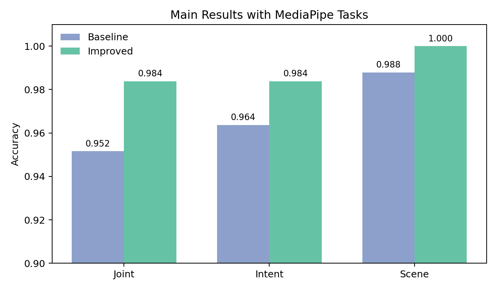
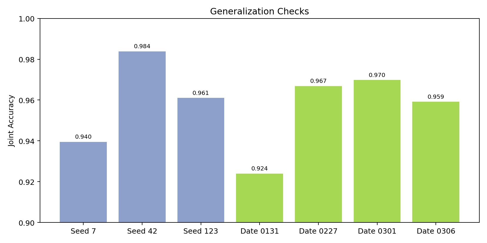
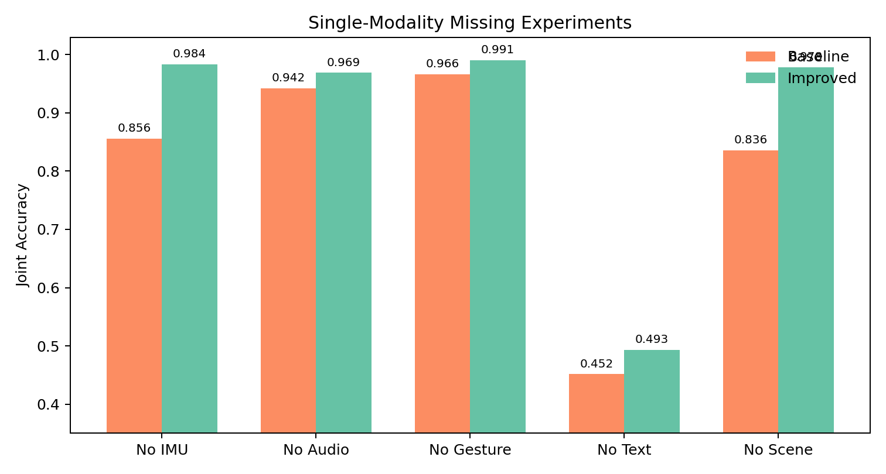
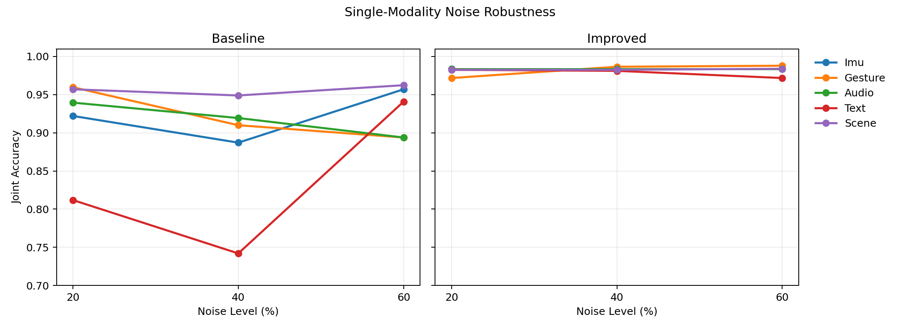

# 多模态用户交互意图理解

本项目面向 AR 眼镜交互场景，研究基于多模态数据的用户意图识别方法。系统融合 IMU、手势视觉、音频、ASR 文本和场景视觉五类模态，完成 6 类交互意图与 2 类场景组合而成的 12 类联合分类任务，并针对模态缺失和模态噪声问题进行了模型改进与系统评估。

## 任务定义

交互意图共 6 类：

```text
menu, select, magnify, narrow, brush, cancel
```

场景共 2 类：

```text
office, museum
```

主任务为 12 类联合分类：

```text
{office, museum} x {menu, select, magnify, narrow, brush, cancel}
```

评价指标包括：

- `joint_acc`：场景和意图同时预测正确。
- `intent_acc`：只评价 6 类意图预测。
- `scene_acc`：只评价 2 类场景预测。

## 模态与特征

| 模态 | 数据来源 | 特征处理 |
|---|---|---|
| IMU | `dataset/imu.csv` | 时间窗口 IMU 时序特征 |
| Gesture | fisheye 视频 | MediaPipe HandLandmarker 定位手部区域，CLIP 提取视觉特征 |
| Audio | HoloLens 视频音频 | MFCC 音频特征 |
| Text | ASR 转写文本 | Whisper 转写，SentenceTransformer 编码 |
| Scene | fisheye 视频 | ViT 场景视觉特征 |

手势特征优先使用 MediaPipe Tasks `HandLandmarker`：

```text
models/hand_landmarker.task
```

当新接口模型不可用时，代码会尝试 legacy MediaPipe Hands；若仍不可用，则退化为整帧 CLIP fallback。

## 方法概述

Baseline 使用统一的多模态 PerceiverIO 融合结构。

改进模型在 baseline 基础上引入：

- Gesture / Text / Scene 主锚点融合。
- IMU / Audio 残差辅助注入。
- 模态 gate 机制。
- 多任务辅助监督，包括 intent、scene、base intent 和 gesture intent 辅助头。
- label smoothing、dropout、weight decay、gradient clipping 等训练稳定策略。

改进模型的目标是在保持正常测试集准确率的同时，提高模态缺失与模态噪声条件下的稳定性。

## 代码结构

```text
code/
  baseline_real_scene.py              # baseline 训练与评估
  train_and_test.py                   # improved 训练与评估
  train.py                            # 统一训练入口
  test.py                             # 统一测试/结果读取入口
  run_generalization_experiments.py   # 泛化检查实验
  run_missing_experiments.py          # 模态缺失实验
  run_noise_experiments.py            # 噪声鲁棒性实验
  collect_experiment_results.py       # 汇总 metrics.json 为 CSV
  visualize_report_summary.py         # 生成结果可视化图
  feature_extraction/                 # 特征提取脚本

docs/figures/
  main_results_mptasks.png
  generalization_checks.png
  single_modality_missing.png
  noise_robustness.png
```

## 实验结果

### 主实验



| 模型 | joint_acc | intent_acc | scene_acc |
|---|---:|---:|---:|
| Baseline + MediaPipe Tasks | 0.9516 | 0.9637 | 0.9879 |
| Improved + MediaPipe Tasks | 0.9839 | 0.9839 | 1.0000 |

### 泛化检查



| 设置 | joint_acc |
|---|---:|
| 默认测试集 seed 7 | 0.9395 |
| 默认测试集 seed 42 | 0.9839 |
| 默认测试集 seed 123 | 0.9610 |
| 日期留出 20260131 | 0.9240 |
| 日期留出 20260227 | 0.9669 |
| 日期留出 20260301 | 0.9698 |
| 日期留出 20260306 | 0.9592 |

默认测试集 3 个随机种子的平均 `joint_acc` 约为 0.9615；按采集日期整批留出的平均 `joint_acc` 约为 0.9550。

### 模态缺失



| 缺失模态 | Baseline joint_acc | Improved joint_acc |
|---|---:|---:|
| no_imu | 0.8562 | 0.9839 |
| no_audio | 0.9422 | 0.9691 |
| no_gesture | 0.9664 | 0.9906 |
| no_text | 0.4516 | 0.4933 |
| no_scene | 0.8360 | 0.9785 |

改进模型在 5 组单模态缺失实验中均优于 baseline。Text 缺失会导致性能显著下降，说明文本语义是意图识别的关键模态；Gesture 与 Scene 对场景识别具有重要作用。

### 噪声鲁棒性



| 噪声设置 | Baseline joint_acc | Improved joint_acc |
|---|---:|---:|
| text_noise_20 | 0.8118 | 0.9825 |
| text_noise_40 | 0.7419 | 0.9812 |
| gesture_noise_60 | 0.8938 | 0.9879 |
| audio_noise_60 | 0.8938 | 0.9839 |
| imu_noise_40 | 0.8871 | 0.9839 |

在 15 组单模态噪声实验中，改进模型全部优于 baseline，表现出更稳定的噪声鲁棒性。

## 运行方式

### 训练

```bash
python code/train.py \
  --model improved \
  --epochs 100 \
  --patience 4 \
  --output-dir outputs/improved_real_scene_anchor2_perceiver_io_mptasks
```

### 测试

```bash
python code/test.py \
  --model improved \
  --output-dir outputs/improved_real_scene_anchor2_perceiver_io_mptasks \
  --show-reports
```

### 模态缺失实验

```bash
python code/run_missing_experiments.py \
  --model improved \
  --epochs 100 \
  --patience 4 \
  --execute
```

### 噪声实验

```bash
python code/run_noise_experiments.py \
  --model improved \
  --epochs 100 \
  --patience 4 \
  --execute
```

### 汇总结果

```bash
python code/collect_experiment_results.py \
  --root outputs \
  --out outputs/experiment_summary_all.csv
```

### 生成可视化图

```bash
python code/visualize_report_summary.py
```

## 主要输出

```text
outputs/experiment_summary_mptasks.csv
outputs/experiment_summary_generalization.csv
outputs/experiment_summary_missing_baseline.csv
outputs/experiment_summary_missing_improved.csv
outputs/experiment_summary_noise_baseline.csv
outputs/experiment_summary_noise_improved.csv
```

训练输出目录包含：

```text
metrics.json
classification_report.txt
intent_classification_report.txt
scene_classification_report.txt
confusion_matrix.png
intent_confusion_matrix.png
scene_confusion_matrix.png
loss_curve.png
modality_contribution.json
modality_contribution_*.png
```

## 说明

数据集视频、特征缓存、模型文件、日志和实验输出体积较大，默认不进入 git。仓库中的 `docs/figures/` 为从本地实验 CSV 生成的轻量可视化结果。
